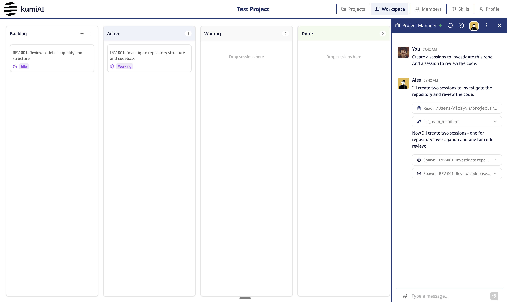
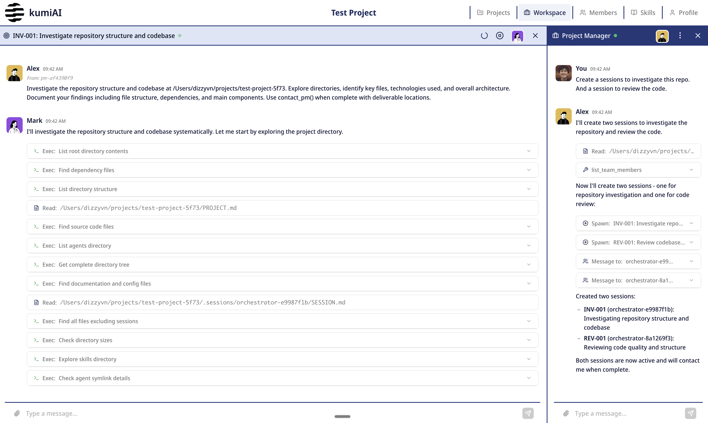

# KumiAI

Project-level multi-agent system powered by Claude. Build AI teams that collaborate on your projects with real-time coordination.

## Screenshots


*Kanban workflow with project management and task organization*


*Real-time agent collaboration and streaming responses*

## What It Does

- **Multi-Agent Collaboration**: Create AI agents with specialized skills that work together on projects
- **AI Assistants**: Built-in assistants help you create and edit skills and agents interactively
- **Skill Management**: Create custom skills or import from [Anthropic's skill library](https://github.com/anthropics/skills)
- **Project Management**: Built-in PM agent coordinates team workflows and task delegation
- **Real-Time Streaming**: Watch agents think and collaborate in real-time via SSE
- **Persistent Sessions**: Sessions resume automatically with full context preservation
- **Kanban Workflow**: Visual project management with drag-and-drop task organization

## Quick Setup

### Prerequisites

- Python 3.10+
- Node.js 18+
- Claude API key (logged in via Claude Code)

### Installation

```bash
# 1. Backend
cd backend
python3 -m venv venv
source venv/bin/activate  # Windows: venv\Scripts\activate
pip install -r requirements.txt

# Start server (database auto-initializes at ~/.kumiai/kumiAI.db)
python -m uvicorn main:app --reload --host 0.0.0.0 --port 7892

# 2. Frontend (new terminal)
cd frontend
npm install
npm run dev
```

- **Backend:** `http://localhost:7892`
- **Frontend:** Check terminal output for the port (typically `http://localhost:5749`)

### First Steps

1. **Manage Skills** → Skills page
   - **Import from GitHub**: Click Import → Paste URL (e.g., `https://github.com/anthropics/skills/tree/main/skills/internal-comms`)
   - **Create Your Own**: Click New Skill → Use the AI assistant (💬 button) for help writing SKILL.md
   - Browse Anthropic's skills: [github.com/anthropics/skills](https://github.com/anthropics/skills)
   - Explore community skills:
     - [VoltAgent/awesome-claude-skills](https://github.com/VoltAgent/awesome-claude-skills)
     - [BehiSecc/awesome-claude-skills](https://github.com/BehiSecc/awesome-claude-skills)
     - [ComposioHQ/awesome-claude-skills](https://github.com/ComposioHQ/awesome-claude-skills)

2. **Create Agents** → Agents page
   - Click New Member → Assign skills → Define personality
   - Use the AI assistant (💬 button) to help write agent configurations

3. **Create Project** → Cmd/Ctrl+P → New Project → Select team & PM

4. **Launch Session** → Kanban → + button → Choose agents → Start

## Data Storage

All data stored in `~/.kumiai/`:
```
~/.kumiai/
├── kumiAI.db       # Database
├── agents/         # Agent definitions
├── skills/         # Skill library
└── projects/       # Project workspaces
```

## Tech Stack

- **Backend**: FastAPI + SQLite + Claude Agent SDK
- **Frontend**: React 18 + TypeScript + Tailwind CSS v4
- **Real-time**: Server-Sent Events (SSE)
- **State**: Zustand

## Configuration (Optional)

```bash
# backend/.env
API_PORT=7892

# frontend/.env.local (for network access)
VITE_API_URL=http://YOUR_IP:7892
```

## API Docs

Visit `http://localhost:7892/docs` after starting the backend.
